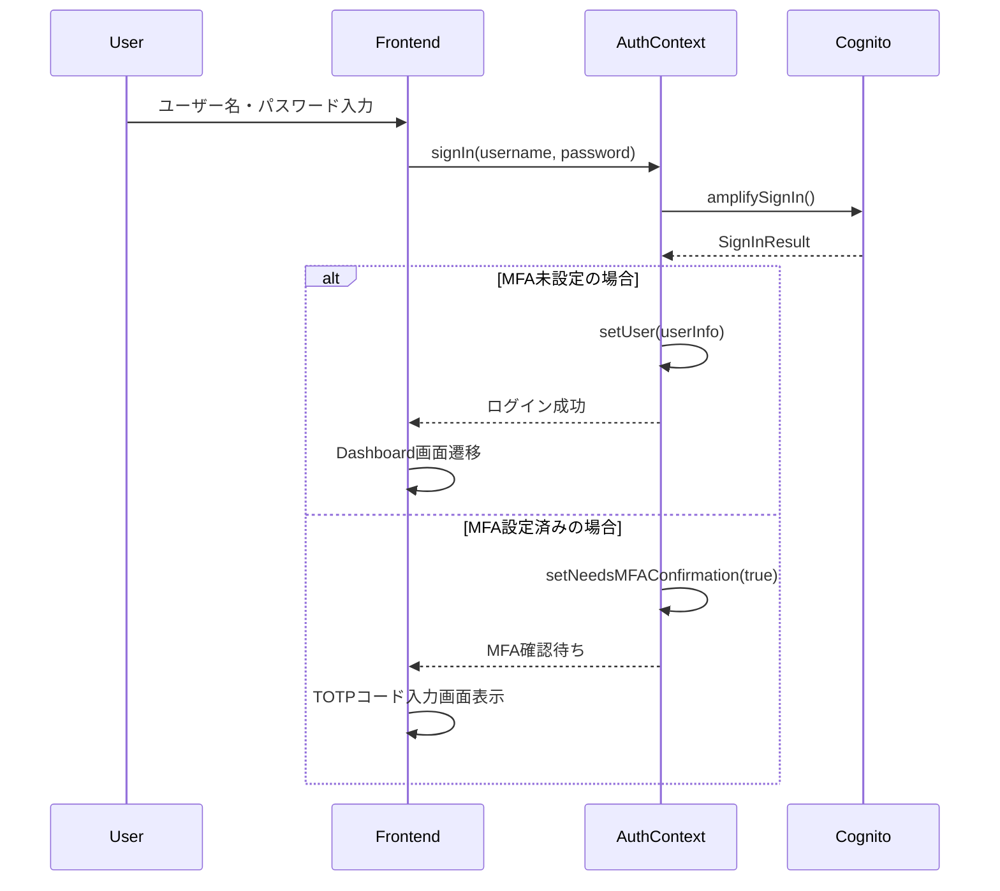
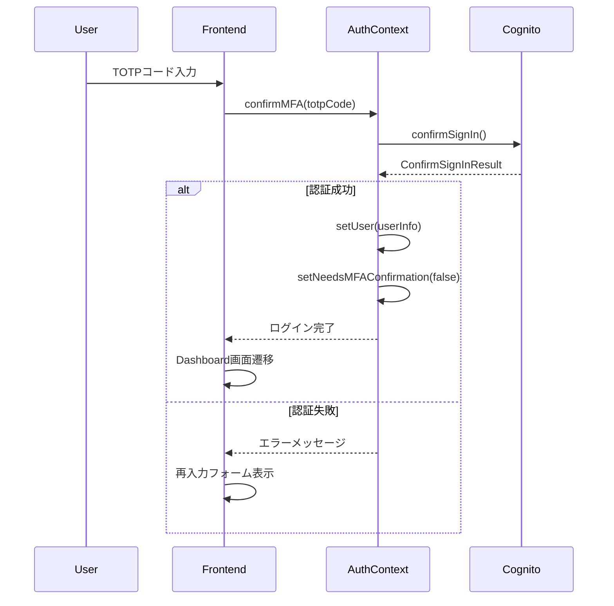
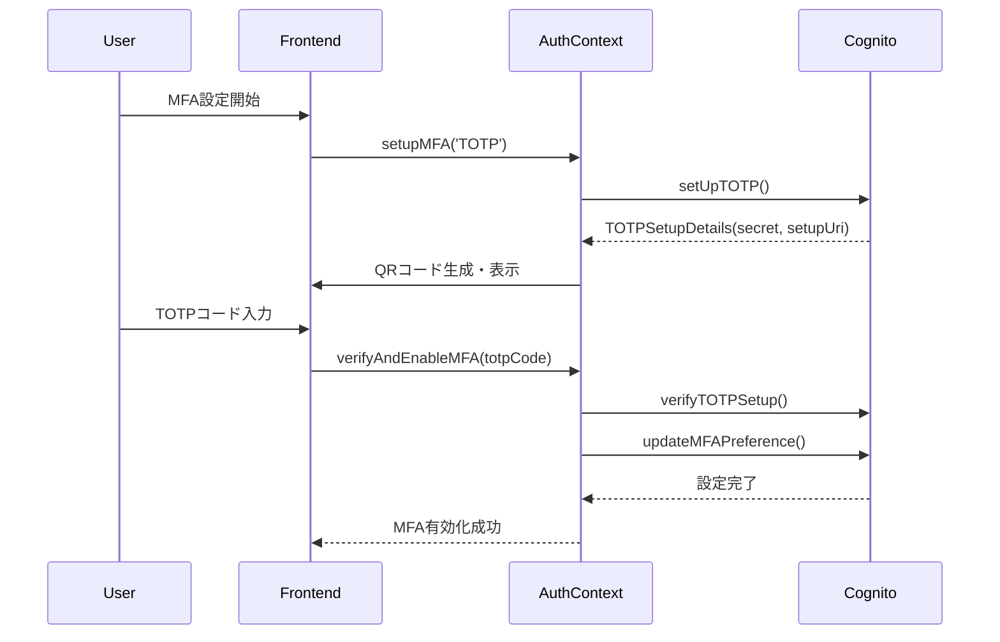
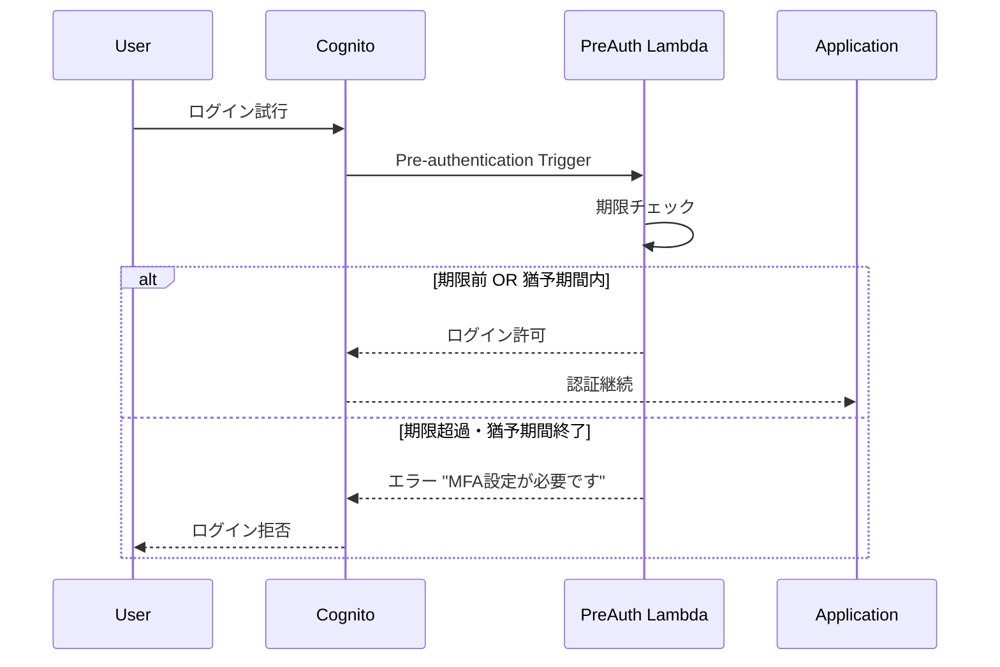

# AWS Cognito MFA移行システム実装

この実装は、AWS Cognitoを使用した多要素認証（MFA）移行システムの完全な実装例です。企業や組織がMFAを段階的に導入する際のベストプラクティスを実際に動作する形で提供します。

## 🎯 お客様向けデモ体験

### まずはこちらから始めてください！

**🚀 [ハンズオンデモガイド（CUSTOMER_DEMO.md）](./CUSTOMER_DEMO.md)**
- **所要時間**: 約20分
- **内容**: 実際にお客様の環境にデプロイして体験
- **成果**: MFA移行の価値とユーザー体験を実感
- **体験方法**: 3人のテストユーザーでMFA設定フローを確認

### デモで確認できること

- ✅ **段階的移行プロセス**: info → warning → error → 必須の自然な流れ
- ✅ **ユーザーフレンドリーな設定**: QRコード + 丁寧なガイド
- ✅ **リアルタイム進捗管理**: 移行状況の可視化
- ✅ **自動セキュリティ制御**: Lambda制御による期限管理
- ✅ **運用効率化**: 管理者の負荷軽減

## 📋 プロジェクト概要

### 実装アーキテクチャ

```
┌─────────────────┐    ┌─────────────────┐    ┌─────────────────┐
│   Frontend      │    │   CDK Backend   │    │   AWS Cognito   │
│   React +       │◄──►│   Lambda +      │◄──►│   User Pools    │
│   Cloudscape    │    │   API Gateway   │    │   (Legacy/New)  │
└─────────────────┘    └─────────────────┘    └─────────────────┘
```

### 技術スタック

**フロントエンド:**
- React 19 + TypeScript
- Cloudscape Design System (AWS公式UIライブラリ)
- AWS Amplify v6 (認証)
- Vite (ビルドツール)
- React Router (ルーティング)

**バックエンド:**
- AWS CDK (Infrastructure as Code)
- AWS Cognito User Pools (認証基盤)
- AWS Lambda (事前認証トリガー)
- Node.js 18+ / TypeScript

## 🚀 主要機能

### ✅ 実装済み機能

1. **デュアルUser Pool構成**
   - レガシープール: MFA任意設定
   - 新プール: MFA必須設定

2. **完全なMFA設定ウィザード**
   - TOTP認証アプリ設定
   - QRコード自動生成
   - 手動シークレットキー入力対応

3. **ダッシュボード**
   - MFAステータス表示
   - 移行進捗バー
   - 期限警告システム

4. **認証フロー**
   - 通常ログイン
   - MFA確認フロー
   - 状態管理（AuthContext）

5. **セキュリティ機能**
   - Lambda事前認証トリガー
   - 期限後猶予期間管理
   - 自動ログインブロック
   - MFA確認時のユーザー名変更制限

6. **状態永続化機能**
   - localStorageによるMFA設定完了状態の保持
   - ページ遷移やリロード時の状態維持
   - サインアウト時の適切なクリーンアップ

## 📁 プロジェクト構成

```
sample-cognito/
├── cdk/                     # CDKインフラ定義
│   ├── lib/
│   │   └── minimal-app.ts   # メインスタック定義
│   └── package.json
├── frontend/                # Reactフロントエンド
│   ├── src/
│   │   ├── components/      # UIコンポーネント
│   │   ├── contexts/        # 状態管理
│   │   │   └── AuthContext.tsx
│   │   ├── pages/           # ページコンポーネント
│   │   │   ├── Dashboard.tsx
│   │   │   ├── Login.tsx
│   │   │   └── MFASetup.tsx
│   │   ├── types/           # TypeScript型定義
│   │   └── config/          # 設定ファイル
│   └── package.json
└── README.md
```

## 🛠️ セットアップ手順

### 前提条件

- Node.js 18+
- AWS CLI設定済み
- AWS CDKインストール済み (`npm install -g aws-cdk`)

### 1. バックエンドデプロイ

```bash
# CDKディレクトリに移動
cd cdk

# 依存関係インストール
npm install

# CDKブートストラップ（初回のみ）
cdk bootstrap

# スタックデプロイ
cdk deploy

# デプロイ後、出力された値をメモ
# - legacy User Pool ID
# - legacy Client ID
# - Region
```

### 2. フロントエンド設定

```bash
# フロントエンドディレクトリに移動
cd frontend

# 依存関係インストール
npm install

# 環境設定ファイル作成
cp .env.example .env.local

# .env.localに以下を設定:
VITE_COGNITO_USER_POOL_ID=us-east-1_xxxxxxxxx
VITE_COGNITO_CLIENT_ID=xxxxxxxxxxxxxxxxxxxxxxxxxx
VITE_COGNITO_REGION=us-east-1
VITE_MFA_DEADLINE=2025-09-01
```

### 3. 開発サーバー起動

```bash
# フロントエンド開発サーバー
npm run dev

# ブラウザで http://localhost:5173 を開く
```

### 4. テストユーザー作成

```bash
# レガシーUser Poolにテストユーザー作成
aws cognito-idp admin-create-user \
  --user-pool-id us-east-1_xxxxxxxxx \
  --username testuser1 \
  --user-attributes Name=email,Value=test@example.com Name=email_verified,Value=true \
  --temporary-password TempPass123! \
  --message-action SUPPRESS

# パスワードを永続化
aws cognito-idp admin-set-user-password \
  --user-pool-id us-east-1_xxxxxxxxx \
  --username testuser1 \
  --password Password123! \
  --permanent
```

## 🔧 主要コンポーネント詳細

### AuthContext (`frontend/src/contexts/AuthContext.tsx`)

認証状態の中央管理を担当。主要機能：

```typescript
// 主要な関数
- signIn(username, password)      // ログイン
- confirmMFA(totpCode)           // MFA確認
- setupMFA(method)               // MFA設定開始
- verifyAndEnableMFA(totpCode)   // MFA検証・有効化
- checkMFAStatus()               // MFAステータス確認
```

**重要な解決済み課題:**
- AWS Amplify v6 API形式: `totp: 'PREFERRED'`が正解
- 無限ループ防止: useEffect依存配列の最適化
- 状態管理一元化: App.tsxとの重複排除
- MFA設定完了状態のlocalStorage永続化実装

### Dashboard (`frontend/src/pages/Dashboard.tsx`)

メインダッシュボード画面。表示内容：

- MFAステータス（有効/未設定）
- 移行進捗バー
- 期限カウントダウン
- ユーザー情報カード
- 警告アラート

### MFASetup (`frontend/src/pages/MFASetup.tsx`)

4ステップのMFA設定ウィザード：

1. **認証方式選択** - TOTP/SMS選択
2. **電話番号設定** - SMS用（準備中）
3. **認証アプリ設定** - QRコード生成・TOTP設定
4. **設定完了** - 完了画面

**技術的特徴:**
- QRコード自動生成
- シークレットキー手動入力対応
- エラーハンドリング充実

### CDKスタック (`cdk/lib/minimal-app.ts`)

AWS インフラ定義。主要リソース：

```typescript
// 主要リソース
- LegacyUserPool (MFA: OPTIONAL)
- NewUserPool (MFA: REQUIRED)  
- UserPoolClients (認証クライアント)
- PreAuthLambda (事前認証トリガー)
- IAMRoles (権限管理)
```

**Lambda事前認証トリガー機能:**
- 移行期限チェック
- 猶予期間管理（7日）
- 期限超過時ログインブロック

## 📊 実装した移行パターン

### 1. Optional MFA + Application Control（採用済み）

**概要**: CognitoでMFA="OPTIONAL"に設定し、アプリケーション側で制御

**実装箇所**: 
- `AuthContext.tsx` - MFAステータス計算
- `Dashboard.tsx` - 警告表示
- `MFAWarningModal.tsx` - モーダル警告

**メリット**:
- ユーザーフレンドリー
- 段階的移行可能
- 柔軟な期限設定

### 2. Lambda Pre-authentication Trigger（実装済み）

**概要**: Lambda関数でログイン時にMFA要件を動的制御、任意の日付期間に差し迫ったら通知可能

**実装箇所**: `minimal-app.ts` 内の PreAuthLambda

**動作ロジック**:
```javascript
if (currentDate > migrationDeadline) {
  if (daysOverDeadline > gracePeriodDays) {
    throw new Error('MFA設定が必要です');
  }
}
```

## 🔄 認証フロー詳細

### 1. 通常ログインフロー



### 2. MFA確認フロー



### 3. MFA設定フロー



### 4. Lambda事前認証トリガーフロー



## 📚 技術実装詳細ドキュメント

**📝 [TECHNICAL_GUIDE.md](./TECHNICAL_GUIDE.md)**
- **対象**: 開発者・技術者
- **内容**: 実装背景、AWS SDK使用方法、アーキテクチャ判断の詳細解説
- **特徴**: コード例と理由を組み合わせた実装ガイド

## 🚀 本番デプロイ準備

### 環境設定

```bash
# 本番環境変数
VITE_COGNITO_USER_POOL_ID=本番User Pool ID
VITE_COGNITO_CLIENT_ID=本番Client ID
VITE_COGNITO_REGION=ap-northeast-1
VITE_MFA_DEADLINE=2025-09-01
```

### ビルド・デプロイ

```bash
# フロントエンドビルド
cd frontend
npm run build

# CDK本番デプロイ
cd ../cdk
cdk deploy --profile production
```
