# AWS Cognito MFA移行システム実装

この実装は、AWS Cognitoを使用した多要素認証（MFA）移行システムの完全な実装例です。企業や組織がMFAを段階的に導入する際のベストプラクティスを実際に動作する形で提供します。

## 📋 プロジェクト概要

### 実装アーキテクチャ

```
┌─────────────────┐    ┌─────────────────┐    ┌─────────────────┐
│   Frontend      │    │   CDK Backend   │    │   AWS Cognito   │
│   React +       │◄──►│   Lambda +      │◄──►│   User Pools    │
│   Cloudscape    │    │   API Gateway   │    │   (Legacy/New)  │
└─────────────────┘    └─────────────────┘    └─────────────────┘
```

### 技術スタック

**フロントエンド:**
- React 19 + TypeScript
- Cloudscape Design System (AWS公式UIライブラリ)
- AWS Amplify v6 (認証)
- Vite (ビルドツール)
- React Router (ルーティング)

**バックエンド:**
- AWS CDK (Infrastructure as Code)
- AWS Cognito User Pools (認証基盤)
- AWS Lambda (事前認証トリガー)
- Node.js 18+ / TypeScript

## 🚀 主要機能

### ✅ 実装済み機能

1. **デュアルUser Pool構成**
   - レガシープール: MFA任意設定
   - 新プール: MFA必須設定

2. **完全なMFA設定ウィザード**
   - TOTP認証アプリ設定
   - QRコード自動生成
   - 手動シークレットキー入力対応

3. **ダッシュボード**
   - MFAステータス表示
   - 移行進捗バー
   - 期限警告システム

4. **認証フロー**
   - 通常ログイン
   - MFA確認フロー
   - 状態管理（AuthContext）

5. **セキュリティ機能**
   - Lambda事前認証トリガー
   - 期限後猶予期間管理
   - 自動ログインブロック

## 📁 プロジェクト構成

```
sample-cognito/
├── cdk/                     # CDKインフラ定義
│   ├── lib/
│   │   └── minimal-app.ts   # メインスタック定義
│   └── package.json
├── frontend/                # Reactフロントエンド
│   ├── src/
│   │   ├── components/      # UIコンポーネント
│   │   ├── contexts/        # 状態管理
│   │   │   └── AuthContext.tsx
│   │   ├── pages/           # ページコンポーネント
│   │   │   ├── Dashboard.tsx
│   │   │   ├── Login.tsx
│   │   │   └── MFASetup.tsx
│   │   ├── types/           # TypeScript型定義
│   │   └── config/          # 設定ファイル
│   └── package.json
└── README.md
```

## 🛠️ セットアップ手順

### 前提条件

- Node.js 18+
- AWS CLI設定済み
- AWS CDKインストール済み (`npm install -g aws-cdk`)

### 1. バックエンドデプロイ

```bash
# CDKディレクトリに移動
cd cdk

# 依存関係インストール
npm install

# CDKブートストラップ（初回のみ）
cdk bootstrap

# スタックデプロイ
cdk deploy

# デプロイ後、出力された値をメモ
# - User Pool ID
# - Client ID
# - Region
```

### 2. フロントエンド設定

```bash
# フロントエンドディレクトリに移動
cd frontend

# 依存関係インストール
npm install

# 環境設定ファイル作成
cp .env.example .env.local

# .env.localに以下を設定:
VITE_USER_POOL_ID=us-east-1_xxxxxxxxx
VITE_USER_POOL_CLIENT_ID=xxxxxxxxxxxxxxxxxxxxxxxxxx
VITE_AWS_REGION=us-east-1
VITE_MFA_DEADLINE=2025-09-01
```

### 3. 開発サーバー起動

```bash
# フロントエンド開発サーバー
npm run dev

# ブラウザで http://localhost:5173 を開く
```

### 4. テストユーザー作成

```bash
# レガシーUser Poolにテストユーザー作成
aws cognito-idp admin-create-user \
  --user-pool-id us-east-1_xxxxxxxxx \
  --username testuser1 \
  --user-attributes Name=email,Value=test@example.com Name=email_verified,Value=true \
  --temporary-password TempPass123! \
  --message-action SUPPRESS

# パスワードを永続化
aws cognito-idp admin-set-user-password \
  --user-pool-id us-east-1_xxxxxxxxx \
  --username testuser1 \
  --password Password123! \
  --permanent
```

## 🔧 主要コンポーネント詳細

### AuthContext (`frontend/src/contexts/AuthContext.tsx`)

認証状態の中央管理を担当。主要機能：

```typescript
// 主要な関数
- signIn(username, password)      // ログイン
- confirmMFA(totpCode)           // MFA確認
- setupMFA(method)               // MFA設定開始
- verifyAndEnableMFA(totpCode)   // MFA検証・有効化
- checkMFAStatus()               // MFAステータス確認
```

**重要な解決済み課題:**
- AWS Amplify v6 API形式: `totp: 'PREFERRED'`が正解
- 無限ループ防止: useEffect依存配列の最適化
- 状態管理一元化: App.tsxとの重複排除

### Dashboard (`frontend/src/pages/Dashboard.tsx`)

メインダッシュボード画面。表示内容：

- MFAステータス（有効/未設定）
- 移行進捗バー
- 期限カウントダウン
- ユーザー情報カード
- 警告アラート

### MFASetup (`frontend/src/pages/MFASetup.tsx`)

4ステップのMFA設定ウィザード：

1. **認証方式選択** - TOTP/SMS選択
2. **電話番号設定** - SMS用（準備中）
3. **認証アプリ設定** - QRコード生成・TOTP設定
4. **設定完了** - 完了画面

**技術的特徴:**
- QRコード自動生成
- シークレットキー手動入力対応
- エラーハンドリング充実

### CDKスタック (`cdk/lib/minimal-app.ts`)

AWS インフラ定義。主要リソース：

```typescript
// 主要リソース
- LegacyUserPool (MFA: OPTIONAL)
- NewUserPool (MFA: REQUIRED)  
- UserPoolClients (認証クライアント)
- PreAuthLambda (事前認証トリガー)
- IAMRoles (権限管理)
```

**Lambda事前認証トリガー機能:**
- 移行期限チェック
- 猶予期間管理（7日）
- 期限超過時ログインブロック

## 📊 実装した移行パターン

### 1. Optional MFA + Application Control（採用済み）

**概要**: CognitoでMFA="OPTIONAL"に設定し、アプリケーション側で制御

**実装箇所**: 
- `AuthContext.tsx` - MFAステータス計算
- `Dashboard.tsx` - 警告表示
- `MFAWarningModal.tsx` - モーダル警告

**メリット**:
- ユーザーフレンドリー
- 段階的移行可能
- 柔軟な期限設定

### 2. Lambda Pre-authentication Trigger（実装済み）

**概要**: Lambda関数でログイン時にMFA要件を動的制御

**実装箇所**: `minimal-app.ts` 内の PreAuthLambda

**動作ロジック**:
```javascript
if (currentDate > migrationDeadline) {
  if (daysOverDeadline > gracePeriodDays) {
    throw new Error('MFA設定が必要です');
  }
}
```

## 🔐 セキュリティ考慮事項

### 実装済みセキュリティ対策

1. **認証トークン管理**: AWS Amplifyの自動管理
2. **TOTP実装**: RFC 6238準拠
3. **期限管理**: サーバーサイド検証
4. **エラーハンドリング**: 情報漏洩防止

### 推奨追加対策

1. **監査ログ**: CloudTrail設定
2. **率制限**: API Gateway設定
3. **バックアップ**: 復旧コード生成
4. **監視**: CloudWatch設定

## 🐛 解決済み技術課題

### 1. AWS Amplify v6 API問題

**問題**: `updateMFAPreference({ TOTP: 'ENABLED' })` エラー

**解決**: 
```typescript
// ❌ 間違い
await updateMFAPreference({ TOTP: 'ENABLED' });

// ✅ 正解
await updateMFAPreference({ totp: 'PREFERRED' });
```

### 2. 無限レンダリングループ

**問題**: useEffect依存配列での無限ループ

**解決**: 
```typescript
// ❌ 問題のあるコード
useEffect(() => {
  checkMFAStatus();
}, [checkMFAStatus]); // 関数が依存配列に

// ✅ 修正後
useEffect(() => {
  checkMFAStatus();
}, []); // 空依存配列で初回のみ実行
```

### 3. TypeScript verbatimModuleSyntax対応

**問題**: `import { AuthContextType } from './types/auth'` エラー

**解決**:
```typescript
// ✅ 修正後
import type { AuthContextType } from './types/auth';
```

### 4. 状態管理競合

**問題**: App.tsx と AuthContext での重複状態管理

**解決**: AuthContext単一責任化、App.tsx簡素化

## 🔄 認証フロー詳細

### 1. 通常ログインフロー

```mermaid
sequenceDiagram
    participant U as User
    participant F as Frontend
    participant A as AuthContext
    participant C as Cognito

    U->>F: ユーザー名・パスワード入力
    F->>A: signIn(username, password)
    A->>C: amplifySignIn()
    C-->>A: SignInResult
    
    alt MFA未設定の場合
        A->>A: setUser(userInfo)
        A-->>F: ログイン成功
        F->>F: Dashboard画面遷移
    else MFA設定済みの場合
        A->>A: setNeedsMFAConfirmation(true)
        A-->>F: MFA確認待ち
        F->>F: TOTPコード入力画面表示
    end
```



### 2. MFA確認フロー

```mermaid
sequenceDiagram
    participant U as User
    participant F as Frontend
    participant A as AuthContext
    participant C as Cognito

    U->>F: TOTPコード入力
    F->>A: confirmMFA(totpCode)
    A->>C: confirmSignIn()
    C-->>A: ConfirmSignInResult
    
    alt 認証成功
        A->>A: setUser(userInfo)
        A->>A: setNeedsMFAConfirmation(false)
        A-->>F: ログイン完了
        F->>F: Dashboard画面遷移
    else 認証失敗
        A-->>F: エラーメッセージ
        F->>F: 再入力フォーム表示
    end
```



### 3. MFA設定フロー

```mermaid
sequenceDiagram
    participant U as User
    participant F as Frontend
    participant A as AuthContext
    participant C as Cognito

    U->>F: MFA設定開始
    F->>A: setupMFA('TOTP')
    A->>C: setUpTOTP()
    C-->>A: TOTPSetupDetails(secret, setupUri)
    A->>F: QRコード生成・表示
    
    U->>F: TOTPコード入力
    F->>A: verifyAndEnableMFA(totpCode)
    A->>C: verifyTOTPSetup()
    A->>C: updateMFAPreference()
    C-->>A: 設定完了
    A-->>F: MFA有効化成功
```



### 4. Lambda事前認証トリガーフロー

```mermaid
sequenceDiagram
    participant U as User
    participant C as Cognito
    participant L as PreAuth Lambda
    participant A as Application

    U->>C: ログイン試行
    C->>L: Pre-authentication Trigger
    L->>L: 期限チェック
    
    alt 期限前 OR 猶予期間内
        L-->>C: ログイン許可
        C-->>A: 認証継続
    else 期限超過・猶予期間終了
        L-->>C: エラー "MFA設定が必要です"
        C-->>U: ログイン拒否
    end
```



## 📅 MFA移行計画・戦略

### フェーズ1: 準備期間（移行3ヶ月前）

**目標**: インフラ準備とユーザー通知

```bash
# 1. デュアルUser Pool環境構築
cdk deploy CognitoMfaMigrationStack

# 2. 移行対象ユーザーの洗い出し
aws cognito-idp list-users --user-pool-id us-east-1_legacy

# 3. 通知システム準備
- メールテンプレート作成
- SMS通知設定
- 社内告知準備
```

**実装チェックリスト:**
- [ ] CDKスタックデプロイ完了
- [ ] フロントエンドMFA設定画面テスト完了
- [ ] Lambda事前認証トリガーテスト完了
- [ ] 通知システム動作確認
- [ ] ユーザー向けガイド作成

### フェーズ2: ソフト移行期間（移行2ヶ月前〜1週間前）

**目標**: 段階的MFA導入とユーザー教育

```typescript
// MFA移行ステータス管理
const migrationPhases = {
  phase1: {
    period: '3ヶ月前〜2ヶ月前',
    action: 'info通知のみ',
    enforcement: false
  },
  phase2: {
    period: '2ヶ月前〜1ヶ月前', 
    action: 'warning通知 + 推奨',
    enforcement: false
  },
  phase3: {
    period: '1ヶ月前〜1週間前',
    action: 'error通知 + 強い推奨',
    enforcement: false
  },
  phase4: {
    period: '1週間前〜期限',
    action: 'urgent通知 + 必須準備',
    enforcement: false
  }
};
```

**週次実施項目:**
- MFA設定進捗レポート生成
- 未設定ユーザーへのリマインド通知
- ヘルプデスク対応状況確認
- システム負荷監視

### フェーズ3: ハード移行期間（期限日〜猶予期間）

**目標**: MFA必須化と猶予期間管理

```typescript
// Lambda事前認証ロジック
const enforceWithGracePeriod = (userAttributes, currentDate) => {
  const deadline = new Date('2025-09-01');
  const gracePeriodDays = 7;
  
  if (currentDate > deadline) {
    const daysOver = Math.ceil((currentDate - deadline) / (1000*60*60*24));
    
    if (daysOver <= gracePeriodDays) {
      // 猶予期間内: 警告付きでログイン許可
      console.log(`猶予期間 ${daysOver}/${gracePeriodDays}日目`);
      return { allow: true, warning: true };
    } else {
      // 猶予期間終了: ログイン拒否
      throw new Error('MFA設定が必要です');
    }
  }
  return { allow: true, warning: false };
};
```

### フェーズ4: 完全移行（猶予期間終了後）

**目標**: 新User Poolへの移行と旧環境廃止

```bash
# 1. 新User Poolでのユーザー再作成
aws cognito-idp admin-create-user \
  --user-pool-id us-east-1_newpool \
  --username migrated_user \
  --user-attributes Name=email,Value=user@company.com

# 2. MFA必須設定確認
aws cognito-idp describe-user-pool \
  --user-pool-id us-east-1_newpool \
  --query 'UserPool.MfaConfiguration'

# 3. 旧環境の段階的廃止
cdk destroy LegacyUserPoolStack
```

## 🔄 オプション→必須への移行戦略

### 戦略1: アプリケーション制御型（推奨・実装済み）

**概要**: Cognito設定は「OPTIONAL」のまま、アプリ側で段階的に必須化

```typescript
// 実装例: AuthContext.tsx
const calculateMFARequirement = (user: User, deadline: Date) => {
  const daysRemaining = Math.ceil((deadline.getTime() - Date.now()) / (1000*60*60*24));
  
  return {
    required: daysRemaining <= 0,          // 期限後は必須
    stronglyRecommended: daysRemaining <= 7,  // 1週間前から強推奨
    showWarning: daysRemaining <= 30,      // 1ヶ月前から警告
    allowSkip: daysRemaining > 0,          // 期限前はスキップ可能
    gracePeriod: daysRemaining <= -7       // 猶予期間判定
  };
};
```

**メリット:**
- ユーザーエクスペリエンス重視
- 段階的移行による混乱最小化
- 柔軟な期限・条件設定
- ロールバック容易

**デメリット:**
- アプリ側実装が複雑
- セキュリティホール可能性

### 戦略2: User Pool分離型（実装済み）

**概要**: レガシープール（任意）→新プール（必須）への段階移行

```typescript
// 移行戦略の実装
class UserPoolMigrationStrategy {
  async migrateUser(userId: string, newPassword: string) {
    // 1. 旧プールからユーザー情報取得
    const oldUser = await this.getLegacyUser(userId);
    
    // 2. 新プールでユーザー作成
    const newUser = await this.createUserInNewPool(oldUser);
    
    // 3. MFA設定移行
    await this.migrateMFASettings(oldUser, newUser);
    
    // 4. 旧ユーザー無効化
    await this.disableLegacyUser(userId);
    
    return newUser;
  }
}
```

**移行フロー:**
1. **準備期間**: 両プール並行運用
2. **移行期間**: ユーザー毎に個別移行
3. **完了期間**: 旧プール廃止

### 戦略3: Lambda制御型（実装済み）

**概要**: Pre-authentication Triggerで動的制御

```javascript
// Lambda実装例
exports.handler = async (event) => {
  const { userAttributes, userName } = event;
  const migrationDeadline = new Date('2025-09-01');
  const currentDate = new Date();
  
  // ユーザー属性からMFAステータス確認
  const mfaEnabled = await checkUserMFAStatus(userName);
  
  if (!mfaEnabled && currentDate > migrationDeadline) {
    const gracePeriodDays = 7;
    const daysOverDeadline = Math.ceil(
      (currentDate.getTime() - migrationDeadline.getTime()) / (1000 * 60 * 60 * 24)
    );
    
    if (daysOverDeadline > gracePeriodDays) {
      // 猶予期間終了: ログイン拒否
      throw new Error('セキュリティ強化のため、多要素認証の設定が必要です。管理者にお問い合わせください。');
    } else {
      // 猶予期間内: 警告ログ出力
      console.log(`WARNING: User ${userName} in grace period (${daysOverDeadline}/${gracePeriodDays} days)`);
    }
  }
  
  return event;
};
```

### 実装推奨の組み合わせ戦略

**Phase 1-3: アプリケーション制御**
```typescript
// ソフトな制御でユーザー教育重視
if (mfaRequired && !user.mfaEnabled) {
  showMFAWarning({
    type: 'warning',
    message: 'セキュリティ強化のため、MFA設定をお願いします',
    allowSkip: true,
    skipText: '後で設定する'
  });
}
```

**Phase 4: Lambda制御**
```typescript
// 期限後はサーバーサイドで強制
if (pastDeadline && !mfaEnabled && !inGracePeriod) {
  throw new Error('MFA設定が必要です');
}
```

**Phase 5: User Pool移行**
```typescript
// 最終的に新プール（MFA必須）へ
await migrateToNewUserPool(userId);
```

## 🚀 本番デプロイ準備

### 環境設定

```bash
# 本番環境変数
VITE_USER_POOL_ID=本番User Pool ID
VITE_USER_POOL_CLIENT_ID=本番Client ID
VITE_AWS_REGION=ap-northeast-1
VITE_MFA_DEADLINE=2025-09-01
```

### ビルド・デプロイ

```bash
# フロントエンドビルド
cd frontend
npm run build

# CDK本番デプロイ
cd ../cdk
cdk deploy --profile production
```

## 📈 監視・運用

### 重要メトリクス

1. **移行進捗率**: MFA設定完了ユーザー数
2. **ログイン成功率**: 認証エラー監視
3. **API エラー率**: Cognito API呼び出し
4. **ユーザーサポート**: 設定困難ユーザー

### CloudWatch設定例

```bash
# Lambda関数のエラー監視
# Cognito認証メトリクス監視
# API Gateway レスポンス時間監視
```

## 🤝 開発・拡張

### ローカル開発

```bash
# フロントエンド
cd frontend
npm run dev

# CDKローカル変更
cd cdk
cdk diff      # 変更確認
cdk deploy    # デプロイ
```

### 新機能追加

1. **SMS MFA対応**: MFASetup.tsx拡張
2. **バックアップコード**: 復旧機能追加
3. **管理画面**: ユーザー管理機能
4. **多言語対応**: i18n実装

## 📚 参考資料

- [AWS Cognito MFA Documentation](https://docs.aws.amazon.com/cognito/latest/developerguide/user-pool-settings-mfa.html)
- [AWS Amplify v6 Authentication](https://docs.amplify.aws/lib/auth/getting-started/q/platform/js/)
- [Cloudscape Design System](https://cloudscape.design/)
- [AWS CDK TypeScript Guide](https://docs.aws.amazon.com/cdk/v2/guide/work-with-cdk-typescript.html)

## 📄 ライセンス

MIT License

---

**開発者向け注意事項**: この実装は教育・検証目的で作成されています。本番環境での使用前に、セキュリティレビューと負荷テストの実施を推奨します。